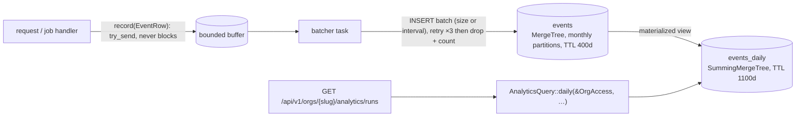

# Analytics (ClickHouse)

Module `analytics_clickhouse` lives in `backend/crates/analytics`. When to use it, and the
measured comparison with PostgreSQL:
[ADR 0008](../../.ai/knowledge/DECISIONS/0008-clickhouse-for-event-analytics.md).



## Events

| event | emitted by | `value` |
|---|---|---|
| `run_created` | API, after the run's transaction commits | calls requested |
| `run_finished` | worker, when a run completes or fails | calls succeeded (`properties`: status, failed, requested) |

Rules for new events:
- Low-cardinality names.
- `properties` is a small JSON object. Never put secrets or personal data in it; use ids, not
  emails.
- The organisation id comes from the server-side context, never from the client.

## Schema and migrations

`schema::MIGRATIONS` is forward-only. It runs at startup through `app_analytics::start`, and is
safe to run concurrently because every statement is idempotent. If ClickHouse is down at startup
the app still starts, logs a warning, and retries on the next start.

## Operations

| config (`[analytics]`) | default | |
|---|---|---|
| `enabled` | `false` | `./dev up` enables it when the module is on (port 58123) |
| `clickhouse_url`, `database`, `user`, `password` | dev values | password via `APP__ANALYTICS__PASSWORD` |
| `batch_size` | 10,000 | rows per `INSERT` |
| `flush_interval_ms` | 1,000 | maximum delay before a partial batch is sent |
| `buffer_capacity` | 100,000 | events waiting; beyond this, new events are dropped and counted |

Operations notes:
- **Readiness**: `/readyz` reports `analytics` as a non-critical check, so it can be degraded
  without failing readiness.
- **Metrics**:
  - `app_analytics_inserted_total`;
  - `app_analytics_dropped_total{reason=buffer_full|closed|insert_failed}`;
  - `app_analytics_insert_seconds`.
- **Shutdown**: the server and the worker flush buffered events before exiting.

## Tests and benchmark

```
TEST_CLICKHOUSE_URL=http://127.0.0.1:58123 cargo test -p app-analytics
TEST_CLICKHOUSE_URL=http://127.0.0.1:58123 cargo test -p app-api --test analytics
python3 benchmarks/run.py --suite analytics
```
