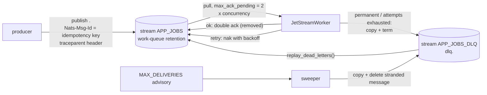

# Messaging: jobs and realtime events

| need | core profile | `messaging_nats` module |
|---|---|---|
| background jobs | PostgreSQL queue (`backend/crates/workers`) | JetStream queue (`app_messaging::nats::JetStreamQueue` + `JetStreamWorker`) |
| realtime events to browsers across instances | `PgEventBus` (LISTEN/NOTIFY) | `NatsEventBus` (core NATS subject) |

[ADR 0007](../../.ai/knowledge/DECISIONS/0007-postgres-queue-default-jetstream-for-scale.md)
explains when to use which, with the measured throughput.

## JetStream queue



| property | how |
|---|---|
| durability | file storage; a message stays in the stream until acked or dead-lettered |
| idempotent publish | `Nats-Msg-Id` deduplicated within `duplicate_window` (default 2 min) |
| at-least-once processing | explicit ack after the handler succeeds; handlers must be idempotent |
| retries | `HandlerError::Retry` → nak with `backoff[attempt-1]` (the last value repeats) |
| dead letters | `HandlerError::Permanent`, or retries exhausted at `max_deliver`, go to `<stream>_DLQ` with headers `Dlq-Reason`, `Dlq-Attempts`, `Dlq-Original-Subject`, `Dlq-Stream-Sequence` |
| crash on the last attempt | JetStream would leave the message stranded. The sweeper listens for `$JS.EVENT.ADVISORY.CONSUMER.MAX_DELIVERIES.<stream>.<durable>`, copies the message to the DLQ and deletes it |
| long handlers | progress acks every `ack_wait / 3`; stopped when the handler ends or is cancelled |
| backpressure | semaphore of `concurrency` permits; at most `2 × concurrency` unacked per consumer |
| graceful shutdown | stop pulling, give in-flight handlers `shutdown_grace`; anything unacked is redelivered |
| tracing | the producer's W3C context goes in headers; each delivery runs in a `message` span that continues it |
| metrics | `app_queue_published_total{stream,result}`, `app_queue_processed_total{stream,kind,result}`, `app_queue_dead_lettered_total`, `app_queue_handler_seconds` |

Usage:

```rust
let client = app_messaging::nats::connect(&cfg.messaging.nats_url, "my-service").await?;
let queue = JetStreamQueue::new(client, QueueConfig::new(&cfg.messaging.stream)).await?;
queue.publish("send_email", payload, Some(&format!("welcome:{user_id}"))).await?;

JetStreamWorker {
    queue: queue.clone(),
    durable: "email-workers".into(),
    filter: queue.subject("send_email"),
    handler: Arc::new(SendEmail { .. }),
    concurrency: 16,
    shutdown_grace: Duration::from_secs(25),
}
.run(shutdown_token)
.await?;
```

## Realtime events

- With `messaging.enabled = true`, the API and the worker publish `RealtimeEvent`s to
  `messaging.events_subject`. Every instance subscribes and re-broadcasts to its own SSE and
  WebSocket clients.
- Delivery is at-most-once by design: realtime events are notifications. The state they describe
  lives in PostgreSQL, and clients refetch on reconnect.
- If NATS is unreachable, events still reach the publishing instance's own clients, and
  `app_events_publish_failures_total` counts the miss.

## Running it

```
./dev up                                   # NATS starts automatically (module enabled); app gets APP__MESSAGING__ENABLED=true
TEST_NATS_URL=nats://127.0.0.1:54222 cargo test -p app-messaging --features nats
python3 benchmarks/run.py --suite messaging
```

NATS monitoring: `http://localhost:58222` (`/jsz`, `/connz`, `/healthz`).
