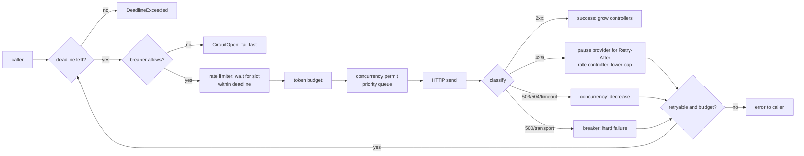

# Outbound API engine

`backend/crates/networking`. One `Provider` per external API. The engine is vendor-neutral: the
same code fronts an LLM API, a payments API or any REST service. Its objective is **successful
useful throughput**, meaning completed work per second, while wasting as little of the provider's
capacity and goodwill as possible. Raw request rate is not the objective.

Measured behaviour: [docs/benchmarks/latest.md § Outbound engine](../benchmarks/latest.md#outbound-engine).
Reproduce with `python3 benchmarks/run.py --suite outbound`. To trace the rate controller over
time, use `backend/target/release/app-bench trace-rate`.

## Pipeline

```text
call(req) ─► deadline ─► circuit breaker ─► request-rate limiter (GCRA, adaptive cap)
          ─► token budget (tokens/min) ─► adaptive concurrency permit (priority queue, bounded)
          ─► pooled HTTP client (keep-alive, HTTP/2 via ALPN, no redirects)
          ─► classify response ─► feed back: concurrency controller, rate controller, breaker, stats
          ─► retry? (idempotent or idempotency-keyed; full jitter; retry budget; Retry-After)
```



## Controllers

Each controller owns exactly one signal. Earlier versions let 429s shrink the concurrency limit
as well. Benchmark traces showed that compounding the two drove the limit down to 1–2, so the
signals are now separated.

| signal | controller | response |
|---|---|---|
| 429 Too Many Requests | **rate** | provider-wide pause for `Retry-After`; cap lowered (see below) |
| 503 / 504 / timeout / sustained latency rise | **concurrency** (AIMD) | limit × 0.75, at most once per drain epoch |
| 2xx while the limit is in use | concurrency | limit + 1/limit |
| 500 / 502 / transport error | **breaker** (hard failure) | opens at ≥50% over the 10 s window |
| ≥95% failures (any kind) over the last 1 s | breaker (outage) | opens; half-open probes; doubling open time |
| 4xx other than 429 | none | caller's problem; the provider is healthy |

### Concurrency (AIMD with a latency signal)

- **Decrease** applies when there is an overload signal: 503, 504, a timeout, or *sustained* latency
  above `max(2 × baseline, baseline + 5 ms)`. Both the sample and an EWMA (α = 0.1) must exceed that
  threshold. The decrease is applied at most once per **drain epoch**: requests already in flight
  were admitted under the old limit, so their failures do not count as new evidence. The absolute
  5 ms floor exists because on fast links, sub-millisecond jitter would otherwise count as
  "2× slower".
- **Increase**: +1/limit per success, and only while ≥80% of the limit is in use. Unused headroom
  is never grown.
- Permits are granted in priority order and then FIFO. The wait queue is bounded, so a full queue
  gives the caller `QueueFull` immediately rather than letting memory grow without limit.

### Request rate (learned from 429s)

Every 429 event costs a full `Retry-After` pause for the whole provider. That is far more
expensive than running slightly below the limit, so the controller **remembers the ceiling and
holds just below it**:

1. **First 429 with too little data** (under 250 ms of un-paused traffic): the cap restarts at the
   observed success rate, and *slow start* applies (×1.15 per 100 ms). At startup the first burst
   measures the provider's burst allowance, not its rate, so this estimate is deliberately not
   trusted as a ceiling.
2. **Later 429 events** (debounced to one per 500 ms): `ceiling = min(cap in force, rate accepted
   over the last ≤500 ms of un-paused time)`. The cap then drops to 85% of the ceiling.
3. **While calm**, growth is credited only for *un-paused* time, and only while the cap is at least
   70% used:
   - Below 95% of the ceiling, the cap grows ×1.05 per 100 ms.
   - At 95%, it holds for 30 s.
   - After that it probes upward at +1% of the ceiling per second, because providers do raise
     limits.
   - Once the cap is 1.5× above the old ceiling, the ceiling is forgotten.
4. The cap never exceeds a configured contract rate (`requests_per_second`).

The GCRA limiter only commits slots up to 50 ms ahead. On a rate change it rescales its
outstanding backlog. Without both, waiters keep slots computed at an old, low rate: the trace
showed 44 req/s actually sent while the cap read 1,000+.

### Circuit breaker

Closed → Open → Half-open:
- In the open state, calls fail fast (`CircuitOpen`) and nothing is sent.
- The open period is 5 s by default and doubles on each consecutive re-open, up to a cap.
- Half-open admits 3 probes. If all succeed the breaker closes; any failure re-opens it.

The outage criterion uses only the most recent 1 s. Judged over the whole 10 s window, a total
outage that follows healthy traffic was diluted, and took about 19 s to open the breaker.

### Retries

Retries apply to idempotent methods, or to requests that carry an idempotency key, which is
reused across attempts.

- **Backoff**: exponential with full jitter.
- **Retry budget**: retries may be at most 20% of first attempts in the window, plus a floor of
  10. This prevents retry storms.
- **Retry-After**: a provider-directed wait is not a retry storm, so it does not spend the budget.
- **Deadline**: no retry is attempted once its wait would pass the caller's deadline.

## Results summary

Simulated provider on loopback, release build. Full tables are in
[docs/benchmarks/latest.md](../benchmarks/latest.md). The *naive* client uses fixed concurrency and
retries immediately, up to 20 times.

- **Rate-limited provider (500 req/s)**:
  - Before the controller fixes, the engine averaged 163 useful req/s.
  - It now runs at a steady 496–500 req/s, after about 3 learning pauses at startup.
  - The naive client completes about 9% of its work and ~99.5% of the requests it sends are rejected.
- **Overloaded provider (capacity about 1,600 req/s)**:
  - The engine completes 100% of the work at about 1,560 req/s, with 0.2% waste.
  - The naive client completes about 22%, with about 99% waste.
- **Outage (2 s of 503s under 400 req/s open-loop load)**:
  - The engine sends 0.48× the offered load to the dead provider; the naive client sends 21×.
  - The engine recovers about 0.46 s after the provider does.
  - Tradeoff: the naive client *completes* more requests that straddle the recovery, because it
    brute-forces through the end of the outage. The engine instead fails fast while the breaker is
    open, and leaves retries to durable callers such as the job queue.

## Configuration

`[providers.definitions.<name>]` in the app config:
- `base_url`, `api_key`;
- `min_concurrency` / `max_concurrency` / `initial_concurrency`;
- `requests_per_second` + `burst`: the contract cap. Leave it at 0 to learn the rate from 429s;
- `tokens_per_minute`;
- `request_timeout_ms`, `connect_timeout_ms`, `max_retries`, `http2_prior_knowledge`.

Health per provider is exposed by `Provider::health()` and appears in the admin system view. It
includes `concurrency_limit`, `inflight`, `queued`, `circuit`, the success/429/5xx/timeout rates,
the latency percentiles, `throughput_rps`, `paused_for_ms` and `rate_cap_rps`.

## Known limits

- Rate-limit headers such as `x-ratelimit-*` and the IETF `RateLimit` / `RateLimit-Policy` headers
  are not parsed yet. Providers that send them would let the engine skip the learning pauses
  entirely. This is the most valuable next improvement.
- Controller state is per process. Several instances that share one provider quota each learn
  independently. Use a configured `requests_per_second` split per instance, or the Redis GCRA
  limiter, when a quota is shared.
- The scenarios are simulated. Real providers add variance (latency tails, per-key versus
  per-organisation limits) that these benchmarks do not model.
