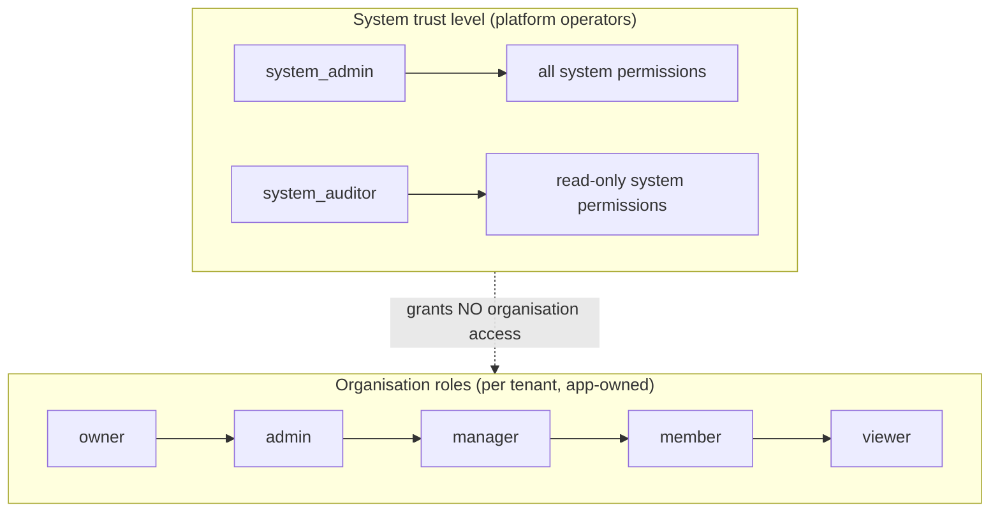
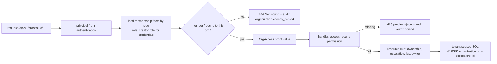

# Authorization

Authorization decides *what an authenticated principal may do*. The Rust backend is the final
boundary (invariant 3). Frontend visibility is never authorization (invariant 2): the UI hides
what the API would refuse anyway. Everything is **denied by default** (invariant 7).

## Two separate trust levels

System roles and organisation roles are independent (invariant 9):
- A `system_admin` has **no** access to any organisation's data through the organisation APIs.
  Support work goes through `/api/v1/admin/*`, where every action is audited.
- An organisation owner has no system privileges.
- System-admin actions can require a session authenticated with MFA
  (`auth.require_mfa_for_system_admin`) and recent re-authentication.

## Organisation permissions (22)

| permission | viewer | member | manager | admin | owner |
|---|:-:|:-:|:-:|:-:|:-:|
| `org:read`, `members:read`, `teams:read`, `roles:read`, `runs:read` | ✓ | ✓ | ✓ | ✓ | ✓ |
| `runs:create`, `runs:manage_own` | | ✓ | ✓ | ✓ | ✓ |
| `members:invite`, `teams:manage`, `runs:manage_any`, `api_keys:read` | | | ✓ | ✓ | ✓ |
| `members:remove`, `members:update_role`, `roles:manage`, `settings:manage`, `org:update`, `audit:read`, `api_keys:manage`, `billing:read` | | | | ✓ | ✓ |
| `org:delete`, `org:transfer_ownership`, `billing:manage` | | | | | ✓ |

Custom roles are per-organisation subsets of this catalogue (`roles:manage`). The catalogue is
code (`backend/crates/authz/src/permission.rs`) and is synced to the `permissions` table at
startup.

## System permissions (10)

`system:users:read|manage`, `system:orgs:read|manage`, `system:audit:read`,
`system:jobs:read|manage`, `system:providers:read`, `system:health:read`, `system:roles:read`.
`system_auditor` holds the seven read permissions; `system_admin` holds all ten.

## How a request is authorized

- **`OrgAccess` is a proof type.** Only the authorizer can construct it. Repository functions for
  tenant data take `&OrgAccess`, not an organisation id, so a handler cannot query another
  tenant's rows by mistake. The organisation id always comes from the proof, never from the
  client (invariant 5).
- **Non-members get 404, not 403.** A non-member cannot even confirm that the organisation exists.
  The probe is audited.
- **Resource rules**:
  - *ownership*: `runs:manage_own` versus `runs:manage_any`;
  - *escalation*: nobody grants a role above their own or acts on a more privileged member;
  - *last owner*: an organisation always keeps at least one owner;
  - *self-role-change*: forbidden. Members may leave; owners transfer ownership instead.
- **Credentials**:
  - API keys and service accounts carry scopes that are a subset of *credential-assignable*
    permissions. Membership administration is never assignable.
  - A key can never exceed what its creator can currently do. If the creator is removed from the
    organisation, the key stops working.

## Policy engines

- **RBAC** (default) is `backend/crates/authz/src/rbac.rs`.
- **Cedar** (optional, feature `cedar`, `authorization.engine = "cedar"`) uses the same
  `Authorizer` trait, with policies in `backend/crates/authz/policies/base.cedar`.
- A conformance test and a differential property test check that RBAC and Cedar make identical
  decisions for generated principals, roles and actions.

## Security tests (invariant 8)

These run in `backend/crates/api/tests/tenancy.rs`, `admin.rs`, `credentials.rs` and `account.rs`,
through the real router and real PostgreSQL:
- `tenant_a_user_cannot_reach_tenant_b_resources`: Tenant A user → Tenant B resource → DENIED;
- `client_supplied_org_ids_are_ignored`;
- `role_matrix_through_the_api` (every role × every action);
- `privilege_escalation_paths_are_blocked`;
- `last_owner_cannot_leave_or_be_demoted`;
- `invitation_requires_matching_verified_email_and_is_single_use`;
- `realtime_subscriber_only_gets_own_tenant`;
- `ordinary_users_and_org_owners_are_denied` (admin);
- `system_admin_requires_mfa_when_configured`;
- `auditor_reads_but_cannot_manage`;
- `api_key_bounded_by_creator_current_role`.

The benchmark invariants also assert that every cross-tenant probe under load is a 404, and every
unauthenticated request is a 401 (`benchmarks/gates.json`).

## Audit (invariant 10)

Security-sensitive operations write to `audit_events`, which is append-only: database triggers
reject UPDATE and DELETE. Metadata is scrubbed of secrets before writing. Passwords, keys and
tokens are never logged.

Recorded actions include:
- `user.login`, `user.logout`, `user.created`, `user.deleted`;
- `organization.*`, `role.assigned`, `role.assign_denied`, `role.system_assigned`;
- `api_key.created`, `api_key.rotated`, `api_key.revoked`, `service_client.registered`;
- `authz.denied`, `organization.access_denied`;
- `admin.user_updated`, `admin.job_retried`, `admin.access_denied`.

Organisation admins read their organisation's trail (`audit:read`); system auditors read the
global trail.
