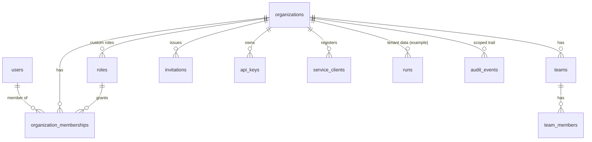

# Multitenancy

Tenancy is organisation-based. A tenant is an `organizations` row, and all tenant data carries an
`organization_id`.

## Model

- **Personal organisation**: every user gets one at first login, so single-user products work
  without any organisation UI (`tenancy.organizations = false` hides it).
- **Memberships**: one role per user per organisation. Roles are built-in (fixed ids, shared by
  all tenants) or custom (per organisation).
- **Teams**: a composite foreign key guarantees team members are members of the team's
  organisation.
- **Invitations** are single-use, expiring, and bound to an email address. Acceptance requires a
  matching *verified* email. Inviting with a role follows the same escalation rules as a role
  change.

## Isolation guarantees

1. **The organisation comes from the URL slug and is resolved against the caller's membership**,
   never from a client-supplied id (invariant 5). Body or query `organization_id` fields are
   ignored; a test proves this.
2. **Repository functions for tenant data take an `OrgAccess` proof**, and every query is
   filtered by `organization_id = access.org_id()`. Composite indexes start with
   `organization_id` (for example `runs_org_created_idx`).
3. **Non-members get 404** for everything under `/orgs/:slug`, with the same response whether the
   organisation exists or not.
4. **Realtime**: SSE and WebSocket events carry an audience (user or organisation) and are
   filtered per subscriber against current membership.
5. **Credentials are bound to one organisation**: API keys and service accounts cannot cross
   tenants, even with valid scopes.
6. **Audit trails are scoped**: organisation admins see only their organisation's events.

## Tenant lifecycle

| event | effect |
|---|---|
| create | the creator becomes `owner`; audited |
| invite / accept | the membership is created with the invited role; audited |
| role change | escalation and last-owner rules; audited |
| member removed | their credentials stop working (the creator-bound check) |
| delete (`org:delete`, owner only) | soft delete (`deleted_at`): the organisation disappears from every query; rows are retained (audit trail; no purge job yet). Personal organisations cannot be deleted. Audited |
| billing | `billing_plan` / `billing_customer_ref` hooks only. The billing provider owns subscriptions |

## Scaling notes

- Shared schema plus row filtering suits up to very large tenant counts with modest per-tenant
  data. If a single tenant outgrows that, add PostgreSQL row-level security as a second guard, or
  move to schema- or database-per-tenant. The `OrgAccess` boundary is the seam where that
  change would go.
- Per-tenant rate limits and quotas can key the shared GCRA limiter by `org:<id>`.
