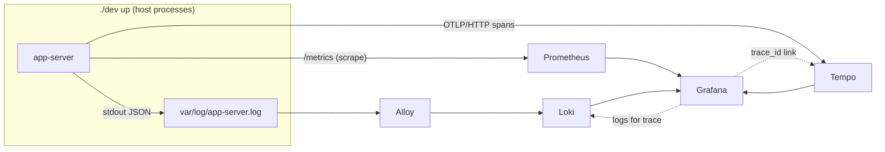

# Observability

There are three signals. Every log line and trace span shares the same `trace_id`.

| signal | produced by | collected by (dev profile) | where to look |
|---|---|---|---|
| metrics | `metrics` facade → Prometheus exposition at `/metrics` (API) and `:9091/metrics` (worker) | Prometheus scrape, every 5 s | Grafana → *App overview*, Prometheus `:59190` |
| traces | `tracing` spans → OpenTelemetry (W3C Trace Context) → OTLP/HTTP | Tempo (`:54318` OTLP) | Grafana → Explore → Tempo |
| logs | `tracing` events → JSON on stdout (`APP__LOG__FORMAT=json`) | `./dev up` tees to `var/log/*.log`; Alloy ships them to Loki | Grafana → Explore → Loki, or the dashboard's log panel |



## Start

```
./dev up --with observability     # app + Prometheus, Tempo, Loki, Alloy, Grafana
open http://localhost:53000       # Grafana (anonymous admin: local development only)
```

With the flag, `./dev up` sets `APP__TELEMETRY__OTLP_ENDPOINT=http://127.0.0.1:54318` and
`APP__LOG__FORMAT=json` for the app processes. Image versions are pinned in
`infra/docker/compose.yaml`:
- Prometheus v3.15.0, Grafana 13.2.3, Loki 3.7.8, Tempo 3.1.0 (monolithic mode, no Kafka) and
  Alloy v1.20.1;
- configuration lives in `infra/docker/observability/`.

These were verified end to end on 2026-10-04:
- one trace id was found both in Tempo (spans) and in Loki (log lines, with `trace_id`
  structured metadata);
- the app-server Prometheus target was `up`, and the dashboard queries returned data;
- all three Grafana datasources were healthy.

## Tracing

- **Spans**:
  - `http` per request: route template, request id, trace id;
  - `job` per job attempt: continues the enqueuing request's trace from `jobs.trace_context`;
  - `provider.call` per outbound call: client span, `traceparent` injected on each attempt.
- **Configuration** (`[telemetry]`):
  - `otlp_endpoint` (empty = no export);
  - `trace_sample_ratio` (new root traces; parent decisions are respected);
  - `trace_propagation` (default `true`);
  - `service_name`.
- **Cost**: about 1.5 µs CPU per request with propagation on. See
  [ADR 0006](../../.ai/knowledge/DECISIONS/0006-trace-propagation-default-on.md).
- **Proof**: `backend/crates/api/tests/tracing.rs` checks that one trace id runs from the request,
  through the job row, to every provider call.

## Metrics

Metric names follow `app_<subsystem>_<thing>_<unit>`. Labels are low-cardinality: route
templates, provider names, status codes, job kinds. They never contain ids, slugs or raw paths,
and a test asserts this.

| family | series |
|---|---|
| HTTP | `app_http_requests_total{method,route,status}`, `app_http_request_duration_seconds`, `app_http_inflight_requests`, `app_http_shed_total`, `app_rate_limited_total` |
| outbound | `app_provider_requests_total{provider,outcome}`, `app_provider_latency_seconds`, `app_provider_concurrency_limit`, `app_provider_learned_rps`, `app_provider_queue_depth`, `app_provider_retries_total`, `app_provider_circuit_opened_total` |
| jobs | `app_jobs_processed_total{queue,kind,result}`, `app_job_duration_seconds`, `app_jobs_inflight` |
| cache | `app_cache_requests_total{result}`, `app_cache_errors_total{backend}` |
| other | `app_events_published_total`, `app_ws_connections`, `app_realtime_lagged_total`, `app_audit_write_failures_total` |

Operational endpoints (`/healthz`, `/readyz`, `/metrics`, `/version`) bypass load shedding and
rate limiting. Otherwise a scrape or health check that shares a client IP with heavy traffic gets
429 or 503, and the balancer pulls a healthy instance out of rotation. This was observed during
verification, and is now covered by `rate_limit_returns_429_with_retry_after` and
`load_is_shed_beyond_max_inflight`.

## Logs

- JSON in production (`log.format = "json"`); human-readable `pretty` in development by default.
- Each event inside a request or job carries `span.request_id` and `span.trace_id`.
- Never logged: request or response bodies, cookies, tokens, provider payloads. The
  `SetSensitiveHeadersLayer` redacts `Authorization`, `Cookie`, `Set-Cookie` and `X-CSRF-Token` in
  traces.
- Volume: `tower_http=debug` logs two lines per request. Keep it off under load: a 5 s load test at
  that level wrote 137 MB.

## Production

- Run an OpenTelemetry Collector or Alloy as an agent or sidecar and point `otlp_endpoint` at it.
  The agent handles retries, batching, tail sampling and fan-out to Tempo or any OTLP backend.
- Logs: collect container stdout (Kubernetes: Alloy or Promtail DaemonSet; systemd:
  journald → Alloy). The JSON shape is the same as in development.
- On Linux Docker, `host.docker.internal:host-gateway` reaches the host's bridge address, not its
  loopback. A host process must listen on that address (`APP__HTTP__HOST=0.0.0.0` behind a
  firewall) to be scraped from a container.
