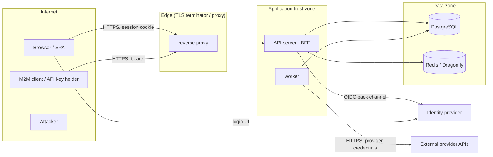

# Threat model

Scope: the blueprint as generated:
- browser SPA;
- Rust API (BFF), with the worker and its outbound engine;
- PostgreSQL;
- optional Redis/Dragonfly;
- an identity provider (ZITADEL or any OIDC);
- external provider APIs.

Method: STRIDE per trust boundary. Each threat names its control, and where possible the test or
gate that proves the control. Residual risks are listed explicitly at the end; they are not hidden.

## System and trust boundaries

Boundaries:
- **B1** browser ↔ API;
- **B2** API ↔ IdP;
- **B3** API/worker ↔ database and cache;
- **B4** worker ↔ external providers;
- **B5** operators ↔ admin console;
- **B6** the build and supply chain.

## Assets

| asset | why it matters |
|---|---|
| session tokens, API keys, service credentials | account and tenant takeover |
| tenant data (runs, members, settings, audit) | confidentiality between customers |
| IdP tokens (ID token for logout), PKCE verifiers | session forging / login hijack |
| provider API keys | cost, data exfiltration through the provider |
| audit trail | accountability, incident response |
| system-admin capability | platform-wide compromise |

## Threats and controls

### B1: browser ↔ API

| STRIDE | threat | control | evidence |
|---|---|---|---|
| S | session theft via XSS | no tokens in JS-reachable storage; HttpOnly `__Host-` cookie; strict CSP (no inline script or style), `nosniff`, framing denied | `browser_never_receives_tokens`, `session_cookie_attributes`, E2E `csp.spec.ts` |
| S | session fixation or replay | new session on login; rotation every 60 min; the old token lapses after 60 s; idle and absolute expiry | `new_login_replaces_existing_session`, `session_rotation_issues_new_cookie_and_old_one_lapses` |
| T | CSRF | Fetch-Metadata/Origin layer plus a per-session `X-CSRF-Token` for cookie-authenticated writes; SameSite=Lax | `csrf_token_required_for_cookie_authenticated_writes`, `cross_site_post_rejected_by_csrf_layer` |
| T | login CSRF / auth-code injection | `state` bound to a browser cookie and single use; nonce; PKCE S256 (verifier encrypted at rest) | `login_csrf_state_must_match_browser_and_is_single_use`, `pkce_and_prompt_parameters_sent` |
| I | open redirect after login | `return_to` must be a same-origin relative path | `return_to_cannot_redirect_off_site` |
| I | cross-tenant read by guessing ids or slugs | `OrgAccess` proof type; tenant-filtered SQL; non-members get 404; client org ids ignored | `tenant_a_user_cannot_reach_tenant_b_resources`, `client_supplied_org_ids_are_ignored`, benchmark invariant: 100% 404 under load |
| E | privilege escalation within an org | role rank checks, last-owner rule, no self role change, invite equals grant | `privilege_escalation_paths_are_blocked`, `role_matrix_through_the_api` |
| D | request floods, slowloris, large bodies | per-client GCRA rate limit; body limit; request timeout; load shedding beyond `max_inflight`; server timeouts | `rate_limit_returns_429_with_retry_after`, `body_limit_enforced`, `request_timeout_returns_504`, `load_is_shed_beyond_max_inflight` |
| R | denial of actions | append-only audit (DB triggers) with actor, IP (optional), UA and request id | `admin_actions_take_effect_and_are_audited`, audit triggers in migration 0004 |

### B2: API ↔ identity provider

| STRIDE | threat | control | evidence |
|---|---|---|---|
| S | forged or replayed ID token | JWKS signature check; issuer, audience (trusted-list only), nonce and expiry verified; alg allowlist | `invalid_id_tokens_are_rejected` (each fault), `extra_id_token_audiences_must_be_explicitly_trusted` |
| S | account linking by email | the identity key is the exact `(issuer, sub)`; email is never used to link | schema `users_identity_key` |
| E | system admin through an unverified email | bootstrap admins only with `email_verified`; optional IdP-managed roles | `bootstrap_admin_requires_verified_email`, `system_roles_from_identity_provider` |
| D | IdP outage | login fails closed with a clear reason; existing sessions keep working (PostgreSQL) | `identity_provider_outage_sends_browser_back_to_login_with_reason` |
| I | SSRF via discovery or redirects | the IdP HTTP client follows no redirects; the issuer is fixed by config | `backend/crates/auth/src/http_client.rs` |

### B3: API ↔ database and cache

| STRIDE | threat | control | evidence |
|---|---|---|---|
| T | SQL injection | compile-time checked SQLx queries; sqlx 0.9 rejects non-literal SQL strings at compile time | `sqlx-offline-fresh` validation |
| I | token disclosure from a DB dump | session tokens stored as SHA-256; API keys HMAC with a server pepper; IdP tokens and PKCE verifiers AES-256-GCM with AAD | `backend/crates/auth/src/{tokens,api_keys,crypto}.rs` |
| R | audit tampering by the application | UPDATE and DELETE on `audit_events` rejected by trigger | migration 0004 |
| D | DB outage | `/readyz` fails, requests return 503 (no crash), jobs survive in the table | `database_outage_yields_503_not_crash` |
| S | stale authorization from a cache | sessions and membership are never cached (ADR 0004); the cache holds application data only | ADR 0004 |

### B4: worker ↔ external providers

| STRIDE | threat | control | evidence |
|---|---|---|---|
| I | credential leak in logs or errors | provider keys are `Secret` (redacted Debug); URLs redacted in errors; bodies never logged | `RedactedUrl`, telemetry conventions |
| S | provider redirects to an attacker host | no redirects; paths must be relative to the configured base URL | `Provider::call` path validation |
| D | retry storms amplifying an outage | retry budget, breaker, provider-wide Retry-After pause | benchmark invariant: amplification ≤ 1.0 (measured 0.48×) |
| T | duplicate side effects on retry | idempotency keys reused across attempts; job idempotency keys | `rate_limited_provider_is_respected_and_work_completes`, `jobs.idempotency_key` |

### B5: operators ↔ admin console

| STRIDE | threat | control | evidence |
|---|---|---|---|
| E | org admin reaching the platform console | the system trust level is separate; org roles never satisfy system checks | `ordinary_users_and_org_owners_are_denied` |
| S | stolen admin session | MFA required (`amr`); step-up re-auth for mutations; suspension revokes sessions | `system_admin_requires_mfa_when_configured`, `mutating_admin_actions_require_recent_authentication` |
| E | auditor modifying state | auditor role is read-only | `auditor_reads_but_cannot_manage` |

### B6: build and supply chain

| threat | control | evidence |
|---|---|---|
| vulnerable or yanked crates | `cargo audit` (RustSec) in validation | `rust-audit` command |
| unwanted licences / sources | `cargo deny` (licences, bans, sources) | `rust-deny`, `backend/deny.toml` |
| vulnerable npm packages | `npm audit --omit=dev --audit-level=high` in validation | `web-audit` command |
| committed secrets | `.env` and `.env.zitadel` gitignored; only `.env.example`; secret pattern scan in validation | `secret-scan` command |
| unpinned base images | images pinned by version in compose and CI | `infra/docker/compose.yaml` |

## Residual risks and assumptions

- **TLS is terminated in front of the app.** Production config refuses non-`https` origins and
  insecure cookies, but certificate management is the deployment's job.
- **`trust_forwarded_for`** must only be enabled behind a proxy that overwrites
  `X-Forwarded-For`. Otherwise clients can spoof their IP for rate limiting and audit.
- **Inbound `traceparent`** is honoured (parent-based sampling). An external caller can force a
  trace to be sampled, which costs a small amount of export volume. At a public edge, strip or
  re-root trace headers in the proxy if this matters.
- **Database superusers** can bypass the audit triggers. Ship audit events to append-only
  external storage, such as object storage with retention locks, for high-assurance deployments.
- **The IdP is trusted** for authentication strength (MFA, passkeys). Compromise of the IdP admin
  is out of scope for the app.
- **Denial of service at the network layer** (volumetric attacks) needs an upstream CDN or WAF;
  the app only defends at the request layer.
- **XSS through a third-party script** is constrained by the CSP, which allows no third-party
  origins. Adding any such origin requires a review against this model.
